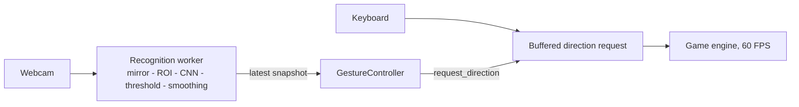

# CNN Gesture Controlled Pac-Man

A Pac-Man-style maze game you steer with your hand. A MobileNetV2 CNN recognises four gestures from
a webcam in real time, and the game turns them into moves.

| Gesture | Command |
|---|---|
| Closed fist | **LEFT** |
| Open palm | **RIGHT** |
| Thumbs up | **UP** |
| Thumbs down | **DOWN** |

```bash
python src/play_gesture.py              # play with gestures (the keyboard still works)
python src/play_gesture.py --no-camera  # keyboard only, no webcam or GPU needed
```

## At a glance

| | |
|---|---|
| Held-out test accuracy | **99.0%** (198/200), Wilson 95% interval **96.4%-99.7%** |
| Unseen people | **99.6%** (1,992/2,000) from 1,727 people with no image in the dataset, 95% interval 99.2%-99.8% |
| Calibration | expected calibration error **0.005** - confidence can be taken at face value |
| Live recognition | threshold 0.90 and 3-of-5 smoothing, both frozen from webcam trials |
| Live performance | game **60 FPS** beside a **30 FPS** recogniser, no backlog over a 330 s run |
| Command latency | **143 ms** mean from a gesture being seen to a stable command |
| Memory | game **47 MB**, flat over 10 simulated minutes; recognizer **22 MB** GPU peak, no growth over 5,000 frames |
| Automated tests | pytest suite plus four self-test scripts, run in CI on every push |
| Known limitation | no reject class: a deliberate unsupported gesture (e.g. a peace sign) can be read as a direction - use only the four |

Status: the project passed final testing and manual acceptance ([FINAL_TEST_REPORT.md](FINAL_TEST_REPORT.md)).
A later quality round added accessibility, security hardening, statistical rigour, a proper test
suite and tooling; see [CHANGELOG.md](CHANGELOG.md).

## How to play

| Key | Action |
|---|---|
| Arrows / WASD | Move |
| P | Pause |
| H or F1 | Help |
| C | Colour theme: classic, high contrast, colour-blind safe |
| M | Sound on / off |
| R | Restart after Game Over |
| ESC | Quit |

Keep your hand inside the box shown in the camera panel. `None` - no confident gesture - never
stops Pac-Man; he keeps going the way he was. Hold a gesture a moment before a junction and the
turn is taken when it becomes possible.

## Setup

Python 3.12 (64-bit) and an NVIDIA GPU with a CUDA 13 driver for gesture control. The keyboard game
needs neither.

```bash
python -m venv venv
venv\Scripts\activate                 # Windows  (source venv/bin/activate elsewhere)
pip install -r requirements.txt       # includes the CUDA build of PyTorch
pip install -r requirements-dev.txt   # testing and quality tools
pip install -e . --no-deps            # makes the `game` and `src` packages importable
python src/environment_check.py       # verifies Python, libraries, CUDA and the webcam
```

`requirements.txt` carries the PyTorch CUDA index, so it installs the GPU build; plain-PyPI `torch`
is CPU-only on Windows and is not supported for the application.

## Architecture



- **Two loops that never wait for each other.** One worker thread owns the webcam and the model;
  the main thread runs the game. They share a single immutable snapshot, never a queue, so a slow
  camera frame cannot slow the game.
- **One input seam.** Gestures and the keyboard both call `game.request_direction`; neither moves
  Pac-Man directly, and the most recent request wins.
- **The game knows nothing about the CNN.** Nothing in `game/` imports `torch`, `cv2` or `src`, and
  the game's self-test fails if that ever changes.

Details, including every timing constant and the evidence behind it, are in
[docs/ARCHITECTURE.md](docs/ARCHITECTURE.md).

## The game

An original 28 x 31 maze with 330 pellets and 4 power pellets, every pellet reachable and no dead
ends. Four ghosts share one navigation rule but aim differently: the Chaser targets Pac-Man, the
Ambusher cuts him off ahead, the Flanker pincers opposite the Chaser, and the Drifter keeps breaking
away. The Chaser speeds up as the board empties, but every ghost stays slower than Pac-Man, so the
game stays fair at gesture latency.

| | |
|---|---|
| Player | 6.2 tiles/s, turns buffered for 0.35 s |
| Ghosts | 5.4 tiles/s, +0.2 per round, capped at 6.0; states house, scatter, chase, frightened, eaten |
| Scoring | pellet 10, power pellet 50, ghosts 200/400/800/1600, fruit 100-5000, extra life at 10,000 |
| Rendering | static maze pre-rendered once per theme - **0.58 ms** per headless frame |
| Persistence | high score, theme and mute saved to `~/.gesture_pacman/profile.json` (atomic writes) |

```bash
python game/main.py              # the keyboard game on its own
python game/main.py --selftest   # rule and separation checks
```

## Accessibility

- **Three colour themes**, switched with `C` and remembered. Tests check every theme's text against
  its backgrounds for WCAG 2.1 contrast of at least 4.5:1.
- **Colour-blind safe palette** based on Okabe-Ito, tested under simulated protanopia,
  deuteranopia and tritanopia so frightened ghosts stay distinct from dangerous ones.
- **Nothing depends on colour alone:** frightened ghosts also change shape, power pellets are larger
  and pulse, and every direction is labelled in text.
- **Sound cues** for pellets, power pellets, ghosts, lost lives and cleared rounds, for players
  watching their hand rather than the maze. Fully optional, and silent when no audio device exists.

## The model

MobileNetV2 with ImageNet weights and a four-way head, trained in two stages on the RTX 3050 Ti:
the head alone, then the last blocks fine-tuned, selected on validation loss. The test split was
never loaded during training and was evaluated exactly once.

| Result | Value |
|---|---|
| Validation accuracy / loss | 99.5% (199/200) / 0.036 |
| Test accuracy | **99.0%** (198/200), Wilson 95% interval 96.4%-99.7% |
| Macro-F1 | 0.990, bootstrap 95% interval 0.974-1.000 |
| Calibration | ECE 0.005, Brier score 0.016, NLL 0.029 |
| At the live 0.90 threshold | 98% of test images accepted, 99.5% of those correct |
| Errors | `right` read as `down` (conf 0.60), `down` read as `up` (conf 0.90) |
| GPU latency, batch 1 | 6.0 ms mean |

The two errors are exactly why smoothing exists: the confident `down`-as-`up` passes the threshold,
but a single frame cannot win a 3-of-5 vote.

```bash
python -m src.analyze_evaluation   # confidence intervals and calibration from the saved predictions
python src/train_model.py          # retrain (overwrites the frozen checkpoint - see SECURITY.md)
```

The confidence intervals matter: with 200 test images, "99%" alone overstates what is known.
A lineage audit found that 41% of test images come from people also in training, because the
dataset was split per image, not per person. So the frozen model was also evaluated once on
2,000 images from 1,727 people it has never seen. It scored **99.6%** (interval 99.2%-99.8%), so
familiar hands did not inflate the result. See [docs/MODEL_CARD.md](docs/MODEL_CARD.md) and
[docs/DATASET_CARD.md](docs/DATASET_CARD.md).
The calibration diagram is in `reports/reliability_diagram.png`.

A 42-run study on train and validation only compared six backbones and nine fine-tuning recipes,
each over three seeds. No backbone was clearly better than MobileNetV2: ResNet-18's validation loss
was within one standard deviation, with five times the parameters. The frozen run's validation loss
(0.036) sits inside MobileNetV2's seed range (0.032-0.051), so it was a typical result, not a lucky
one. See [docs/MODEL_STUDY.md](docs/MODEL_STUDY.md).

## Live recognition

| Setting | Value | Why |
|---|---|---|
| Threshold | 0.90 | Intentional gestures never below 0.961 live; idle and absent hands never above 0.617 |
| Smoothing | 3 of 5 frames | Stops a single confident wrong frame from turning Pac-Man |
| ROI | 300 x 300 of a mirrored 640 x 480 frame | Matches how the training crops were built |

Live trials: 80/80 held gestures, 0/40 false commands from idle or absent hands, 0/6 wrong turns in
natural-speed transitions.

```bash
python src/realtime_gesture.py              # live preview with overlay
python src/realtime_gesture.py --selftest   # checks against the real camera
python src/realtime_gesture.py --trials     # guided trial recorder
```

## Security

The model file is verified against a pinned SHA-256 and loaded with `torch.load(weights_only=True)`,
so a tampered or malicious checkpoint cannot load or run code; its class mapping must also match.
See [SECURITY.md](SECURITY.md) for the full threat model.

## Dataset

2,000 hand-region crops from [HaGRID](https://huggingface.co/datasets/cj-mills/hagrid-sample-500k-384p)
(CC-BY-SA-4.0), 500 per class: `fist`, `palm`, `like` and `dislike`. Each crop is the official
bounding box padded 25% and squared, to resemble the webcam's hand region. Thumbs-up and thumbs-down
come from their own classes, never by rotating one into the other, and training augmentation never
flips vertically.

```bash
python src/crop_hagrid_hands.py --promote          # build the dataset (reads the archive by range requests)
python src/check_dataset.py --grid --updown-grid   # integrity checks and QA sheets
python src/check_data_pipeline.py                  # split, transform and determinism checks
```

The split is 1600/200/200, stratified with seed 42, and reproducible byte for byte.

## Development

```bash
pytest                               # every test, including the self-test scripts; GPU, webcam and
                                     # dataset tests skip themselves when those are absent
pytest --cov=game --cov=src          # with coverage
pytest -m "not slow"                 # quick loop while editing
ruff format . && ruff check .        # formatting and lint
mypy game src tests                  # static types
python -m src.measure_memory --game  # memory profile (--recognizer for the CUDA model)
python -m src.evaluate_external      # frozen model on unseen people (after the lineage audit)
```

CI runs formatting, lint, types, the test suite and a dependency audit on every push. See
[CONTRIBUTING.md](CONTRIBUTING.md) for the project rules that protect the reported results, and
[docs/MANUAL_TEST_PLAN.md](docs/MANUAL_TEST_PLAN.md) for the checks that need a real hand.

## Project structure

```text
gesture-controlled-game/
├── game/                     # the game - Pygame only, no CNN
│   ├── engine.py             # rules, rounds, drawing
│   ├── maze.py  entity.py  player.py  ghost.py  controls.py
│   ├── theme.py  audio.py  profile.py
│   └── main.py               # keyboard launcher and self-test
├── src/                      # recognition, training, evaluation and the application
│   ├── play_gesture.py       # the application
│   ├── game_integration.py   # recognition worker and gesture bridge
│   ├── gesture_recognizer.py
│   ├── data_pipeline.py  train_model.py  evaluate_model.py  analyze_evaluation.py
│   ├── model_study.py  audit_hagrid_lineage.py  evaluate_external.py  measure_memory.py
│   ├── crop_hagrid_hands.py  check_dataset.py  check_data_pipeline.py  collect_dataset.py
│   ├── realtime_gesture.py  environment_check.py
│   └── check_integration.py  check_ui.py  check_final_application.py
├── tests/                    # pytest suite
├── docs/                     # architecture, model and dataset cards, model study, manual test plan
├── reports/                  # generated analyses (QA image sheets go to reports/qa/, untracked)
├── model/                    # the frozen checkpoint and its training and evaluation records
├── dataset/                  # 500 images per class (images not tracked in git)
├── archive/                  # retired scripts, kept for the record
├── pyproject.toml  requirements.txt  requirements-dev.txt
├── README.md  CHANGELOG.md  CONTRIBUTING.md  SECURITY.md
└── PROJECT_SPEC.md  FINAL_TEST_REPORT.md
```

## Credits

Hand images: HaGRID, Kapitanov et al., licensed CC-BY-SA-4.0. Model weights: torchvision's
ImageNet-pretrained MobileNetV2. Maze, graphics and sound effects are original to this project.
