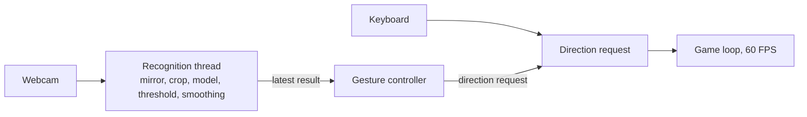
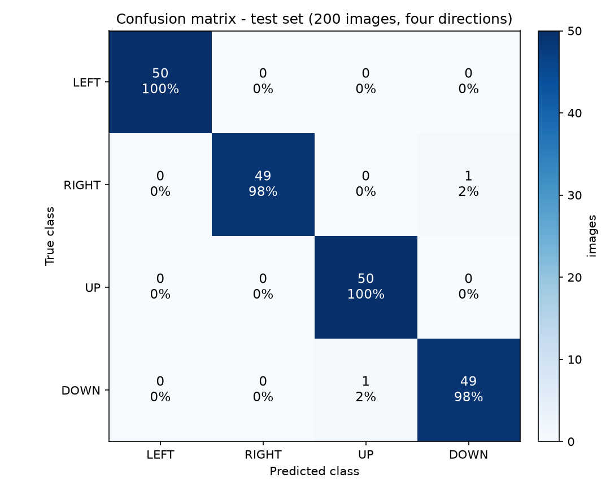
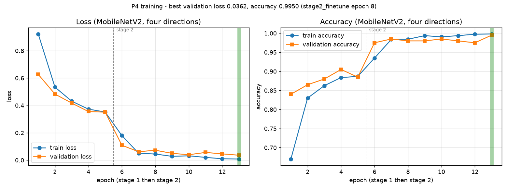

# CNN Gesture Controlled Pac-Man

[](https://github.com/TanmaySingh2711/gesture-controlled-game/actions/workflows/ci.yml)

A Pac-Man-style maze game that you steer with hand gestures in front of a webcam.

| Gesture | Pac-Man goes |
|---|---|
| Closed fist | LEFT |
| Open palm | RIGHT |
| Thumbs up | UP |
| Thumbs down | DOWN |

## Quick Start

You need Python 3.12. A webcam is needed only for gesture control.

```bash
git clone https://github.com/TanmaySingh2711/gesture-controlled-game.git
cd gesture-controlled-game
python install.py                        # one-time setup
venv\Scripts\activate                    # Windows (elsewhere: source venv/bin/activate)
python src/play_gesture.py               # play with gestures and keyboard
```

On Windows you can skip the terminal: double-click `setup.bat` once, then `run_game.bat`.

## Table of Contents

- [Quick Start](#quick-start)
- [Overview](#overview)
- [Problem Statement](#problem-statement)
- [Objectives](#objectives)
- [Key Features](#key-features)
- [Tech Stack](#tech-stack)
- [Architecture](#architecture)
- [How It Works](#how-it-works)
- [Project Structure](#project-structure)
- [Requirements](#requirements)
- [Installation](#installation)
- [Configuration](#configuration)
- [How to Run](#how-to-run)
- [Usage](#usage)
- [Example Output](#example-output)
- [Model Details](#model-details)
- [Dataset](#dataset)
- [Results](#results)
- [Limitations](#limitations)
- [Development](#development)
- [Contributing](#contributing)
- [License](#license)
- [Author](#author)
- [Credits](#credits)

## Overview

This is a maze game in the style of Pac-Man. You eat pellets, avoid four ghosts and clear rounds.

The difference is how you steer. A webcam watches your hand. A small neural network looks at each
frame and decides which of four gestures you are showing. The game turns that into a direction.

The keyboard works at the same time, so you can always fall back to the arrow keys. You can also
play with the keyboard only, with no webcam at all.

The trained model is included in the repository, so the game works right after setup. You do not
need to download a dataset or train anything.

## Problem Statement

Games are usually played with a keyboard, a mouse or a controller. This project tries a
different input: your bare hand in front of an ordinary webcam.

That sounds simple, but it has real problems to solve:

- The model must be right almost every time. One wrong reading sends Pac-Man into a ghost.
- It must be fast. A turn that arrives late is a missed turn.
- A slow camera frame must never slow the game down.
- An empty frame or a relaxed hand must not turn Pac-Man by accident.

## Objectives

- Recognise four hand gestures from a live webcam, reliably.
- Turn those gestures into game moves with little delay.
- Keep the game at 60 frames per second while recognition runs beside it.
- Stay playable without an NVIDIA GPU, and without a webcam.
- Measure the results honestly, including where the model fails.

## Key Features

**The game**

- **Original maze** – a 28 x 31 maze with 330 pellets and 4 power pellets.
- **Four ghosts** – each one chases in its own way: the Chaser, the Ambusher, the Flanker and
  the Drifter.
- **Classic rules** – power pellets, frightened ghosts, bonus fruit, 3 lives, an extra life at
  10,000 points, and rounds that get harder.
- **Saved high score** – your best score, colour theme and sound setting are remembered.
- **Sound effects** – short sounds for pellets, ghosts and lost lives. They can be muted.

**Gesture control**

- **Four gestures** – fist, open palm, thumbs up and thumbs down.
- **Keyboard always works** – arrow keys and WASD work together with gestures.
- **Camera panel** – a side panel shows what the camera sees and the command in use.
- **Protection from wrong turns** – a gesture must be confident, and must hold for 3 of the last
  5 frames, before it becomes a command.
- **Camera recovery** – if the webcam stops, the game tries to reconnect. If that fails, you
  keep playing on the keyboard.

**Other**

- **Runs without a GPU** – the model uses an NVIDIA GPU when there is one, and the CPU otherwise.
- **Accessibility** – three colour themes (classic, high contrast, colour-blind safe). Nothing
  in the game depends on colour alone.
- **One-click setup** – a single script creates the environment and checks that it works.
- **Model file protection** – the model file is checked against a fixed checksum before loading.

## Tech Stack

| Area | What is used |
|---|---|
| Language | Python 3.12 |
| Game | Pygame |
| Model | PyTorch and torchvision (MobileNetV2) |
| Camera and image handling | OpenCV, Pillow, NumPy |
| Evaluation and plots | scikit-learn, Matplotlib |
| Tests | pytest, pytest-cov, Hypothesis |
| Code quality | ruff (format and lint), mypy (types), pre-commit, pip-audit |
| CI | GitHub Actions on Windows, macOS and Linux |

## Architecture


```mermaid
flowchart LR
    cam[Webcam] --> worker["Recognition thread<br/>mirror, crop, model, threshold, smoothing"]
    worker -- latest result --> ctrl[Gesture controller]
    keys[Keyboard] --> seam
    ctrl -- direction request --> seam[Direction request]
    seam --> game["Game loop, 60 FPS"]
```

There are two loops, and they never wait for each other:

- **The recognition thread** owns the webcam and the model. It reads a frame, runs the model and
  publishes the result.
- **The main thread** runs the game: input, movement, ghosts and drawing.

They share only the latest result. Old results are thrown away, never queued. So a slow camera
frame cannot slow the game.

Gestures and the keyboard both go through the same direction request. Neither moves Pac-Man
directly. The game code in `game/` does not import PyTorch or OpenCV at all.

More detail is in [docs/ARCHITECTURE.md](docs/ARCHITECTURE.md).

## How It Works

1. The webcam gives a 640 x 480 frame.
2. The frame is mirrored, so moving your hand right moves it right on screen.
3. A fixed 300 x 300 box is cut out of the frame. This is the area where you hold your hand.
4. The box is resized to 160 x 160 and given to the model.
5. The model returns a score for each of the four gestures.
6. If the best score is below 0.90, the frame is ignored.
7. A gesture becomes a command only after it wins 3 of the last 5 frames.
8. The command is sent to the game as a direction request.
9. Pac-Man takes the turn at the next place where that turn is possible.

When there is no confident gesture, nothing happens. Pac-Man keeps moving the way he was going.
He never stops on his own.

## Project Structure

```text
gesture-controlled-game/
├── README.md  LICENSE
├── install.py                # one-command setup
├── setup.bat  setup.sh       # one-click wrappers around install.py
├── run_game.bat              # double-click to play (Windows)
├── pyproject.toml            # packaging and tool settings
├── game/                     # the game itself (Pygame only, no model code)
│   ├── engine.py             # rules, rounds, drawing
│   ├── maze.py  player.py  ghost.py  entity.py  controls.py
│   ├── theme.py  audio.py  profile.py
│   └── main.py               # keyboard-only launcher and self-test
├── src/                      # gesture recognition, training and evaluation
│   ├── play_gesture.py       # the full application
│   ├── gesture_recognizer.py # model, threshold and smoothing
│   ├── game_integration.py   # recognition thread and gesture controller
│   ├── realtime_gesture.py   # live preview and trial recorder
│   ├── train_model.py  data_pipeline.py  model_study.py
│   ├── evaluate_model.py  evaluate_external.py  evaluate_robustness.py
│   ├── crop_hagrid_hands.py  audit_hagrid_lineage.py  collect_dataset.py
│   ├── environment_check.py  live_report.py  measure_memory.py
│   └── check_*.py            # standalone self-test scripts
├── tests/                    # pytest suite
├── requirements/             # cuda.txt, cpu.txt, dev.txt
├── model/                    # the trained model and its training history
├── dataset/                  # image folders (images not in git), split and class mapping
├── dataset_external/         # list of the extra test images (images not in git)
├── reports/                  # evaluation results and figures
└── docs/                     # architecture, model card, dataset card and more
```

Tool caches and coverage files go into a `.cache/` folder. It is ignored by git and safe to
delete.

## Requirements

- **Python 3.12, 64-bit.** The setup script checks this and stops on any other version.
- **Windows, macOS or Linux.**
- **A webcam**, for gesture control. Not needed for keyboard play.
- **An internet connection for setup.** With an NVIDIA GPU, the PyTorch download alone is about
  2 GB. The CPU version is much smaller.

An NVIDIA GPU is optional. Without one, the model runs on the CPU.

On a minimal Linux install, OpenCV also needs one system package:

```bash
sudo apt-get install libgl1
```

## Installation

Clone the repository:

```bash
git clone https://github.com/TanmaySingh2711/gesture-controlled-game.git
cd gesture-controlled-game
```

Then run the setup. Pick the way that suits you.

**Windows, without a terminal:** double-click `setup.bat`.

**macOS or Linux:**

```bash
bash setup.sh
```

**Any system, from a terminal:**

```bash
python install.py
```

All three do the same thing:

1. Create a virtual environment in `venv/`.
2. Install PyTorch with GPU support if an NVIDIA GPU is found, or the CPU version otherwise.
3. Install the other libraries and the project itself.
4. Run a check that loads the model and times it on your machine.

Useful options:

| Command | What it does |
|---|---|
| `python install.py --dev` | Also installs the test and code-quality tools |
| `python install.py --cpu` | Uses the CPU version of PyTorch even if a GPU is found |
| `python install.py --fresh` | Rebuilds `venv/` from scratch. Use it after moving the project folder |

<details>
<summary>Manual setup</summary>

```bash
python -m venv venv
venv\Scripts\activate                     # Windows (use: source venv/bin/activate elsewhere)
pip install -r requirements/cuda.txt      # NVIDIA GPU. Without one: requirements/cpu.txt
pip install -e . --no-deps
python src/environment_check.py
```

</details>

## Configuration

There is nothing you must configure. The project uses no API keys, no accounts and no `.env`
file.

**Command-line options** for `src/play_gesture.py`:

| Option | Meaning |
|---|---|
| `--no-camera` | Keyboard only. The model and webcam are not loaded |
| `--device auto\|cuda\|cpu` | Where the model runs. Default is `auto` |
| `--benchmark FRAMES` | Run for a number of frames, print a speed report and exit |
| `--threshold VALUE` | Change the 0.90 confidence threshold, for testing |
| `--log-level LEVEL` | `DEBUG`, `INFO`, `WARNING` or `ERROR` |

**Optional environment variables:**

| Variable | Meaning |
|---|---|
| `GESTURE_PACMAN_HOME` | Folder for the saved profile. Default is `~/.gesture_pacman/` |
| `GESTURE_WEBCAM_TESTS=1` | Also run the tests that need a real webcam |

## How to Run

**Windows:** double-click `run_game.bat`.

**From a terminal**, after activating the environment
(`venv\Scripts\activate` on Windows, `source venv/bin/activate` elsewhere):

```bash
python src/play_gesture.py               # gestures and keyboard
python src/play_gesture.py --no-camera   # keyboard only
python game/main.py                      # the plain game, without the gesture panel
```

A game window opens. There is no web page or server to open.

## Usage

1. Start the game. A start screen shows the four gestures.
2. Wait until the camera is ready, then press **SPACE** or **ENTER**.
3. Sit about an arm's length from the webcam, in a well-lit room.
4. Hold your hand inside the box shown in the camera panel on the right.
5. Show a gesture to turn. The panel shows the command that is steering Pac-Man.
6. Hold the gesture a moment before a junction. Pac-Man turns when the turn becomes possible.

Use only the four gestures. Other hand shapes can be mistaken for one of them.

**Keyboard:**

| Key | Action |
|---|---|
| Arrow keys / WASD | Move |
| P | Pause |
| H or F1 | Help |
| C | Change colour theme |
| M | Sound on / off |
| R | Restart after Game Over |
| ESC | Quit |

**Scoring:**

| Item | Points |
|---|---|
| Pellet | 10 |
| Power pellet | 50 |
| Ghosts eaten in a row | 200, 400, 800, 1600 |
| Bonus fruit | 100 to 5000 |

## Example Output

The setup check, `python src/environment_check.py --skip-webcam`, on a laptop with an NVIDIA
RTX 3050 Ti (shortened):

```text
[PASS] Python             3.12.10
[PASS] PyTorch            version 2.14.0+cu130
[PASS] CUDA available     True (CUDA runtime 13.0, cuDNN 92400)
...
[PASS] OpenCV             version 5.0.0
[PASS] Gesture model      checksum verified, 11.5 ms per frame on cuda
[PASS] Pygame             version 2.6.1
...
RESULT: PASS (all 14 checks passed)
```

A speed report, `python src/play_gesture.py --benchmark 600 --device cpu`, on the same laptop
using only the CPU (shortened):

```text
game: 600 frames | 58.0 FPS | frame p95 20.0 ms
camera: 167 frames | 26.8 FPS | CNN mean 12.42 ms | median 12.39 | p95 14.42 | reconnects 0
...
worker stopped cleanly: True
```

## Model Details

| | |
|---|---|
| Model | MobileNetV2 from torchvision, pretrained on ImageNet, with a new 4-way output layer |
| Size | 2,228,996 parameters, about 9 MB on disk |
| Input | A 160 x 160 colour image of the hand area |
| Output | A score for each of `left`, `right`, `up`, `down` |
| File | `model/best_direction_model.pt` |

**Training** was done in two stages on 1,600 images:

1. Train only the new output layer, with the rest of the network frozen.
2. Unfreeze the last blocks and fine-tune them with a lower learning rate.

The best version was picked by validation loss. Training images were flipped left-right,
slightly rotated, shifted and brightened at random. They were never flipped upside down,
because that would turn a thumbs up into a thumbs down.

**At run time**, two rules sit on top of the model:

- A frame counts only if the model is at least 90% confident.
- A gesture becomes a command only if it wins 3 of the last 5 frames.

Both settings were chosen from live webcam trials, not from the test images.

More detail: [docs/MODEL_CARD.md](docs/MODEL_CARD.md) and
[docs/MODEL_STUDY.md](docs/MODEL_STUDY.md), which compares six network types and finds none
clearly better than MobileNetV2.

## Dataset

The images come from [HaGRID](https://huggingface.co/datasets/cj-mills/hagrid-sample-500k-384p),
a public hand-gesture dataset (CC-BY-SA-4.0).

- **2,000 images**, 500 per gesture, from the HaGRID classes `fist`, `palm`, `like` and `dislike`.
- Each image is cut down to the hand, using the bounding box that comes with HaGRID, with some
  padding around it. This makes the images look like the webcam's hand area.
- **Split:** 1,600 for training, 200 for validation, 200 for testing.

The images are not stored in this repository. You only need them to retrain or re-evaluate the
model. To rebuild them:

```bash
python src/crop_hagrid_hands.py --promote   # downloads only the images it needs
python src/check_dataset.py                 # checks the result
```

A second set of 2,000 images, from 1,727 people who do not appear in the dataset at all, is
used to test the model on new hands.

More detail: [docs/DATASET_CARD.md](docs/DATASET_CARD.md).

## Results

All numbers below come from files in `reports/` and `model/`.

**Accuracy**

| Test | Result |
|---|---|
| Test images (200, never used in training) | 99.0% (198 of 200). 95% range: 96.4% to 99.7% |
| People the model has never seen (2,000 images) | 99.6% (1,992 of 2,000). 95% range: 99.2% to 99.8% |
| Macro F1 on the test images | 0.990 |





**Speed**

| Measure | Result |
|---|---|
| Model on an RTX 3050 Ti | 6.0 ms per image |
| Model on the CPU, full webcam frame | about 12 ms |
| Game and camera over a 330 second run, with the GPU | 60 FPS game, 30 FPS camera |
| Memory | 47 MB for the game; 22 MB peak GPU memory for the model |

**Live webcam trials** (one webcam, one room)

| Trial | Result |
|---|---|
| Holding a gesture | 80 of 80 recognised |
| Empty box or relaxed hand | 0 false commands in 40 trials |
| Changing from one gesture to another | 2 of 18 changes passed through a wrong command |
| Time for a whole gesture change | median 1.3 s in one run, 2.9 s in an earlier one |

Most of that change time is the hand moving. Once the model first sees the new gesture, it takes
143 ms on average to make it a command.

**Camera conditions** (simulated on the 2,000 unseen-people images)

| Condition | Accuracy |
|---|---|
| Normal | 99.6% |
| Dim light, colour casts, heavy JPEG, low resolution, tilted hand | 97.9% to 99.4% |
| Very bright light | 94.0% |
| Moderate camera noise | 94.3% |
| Strong blur | 76.7% |
| Heavy camera noise, as in a dark room | 58.6% |

**Tests:** about 510 automated tests. Coverage is 94% when run without a GPU or the dataset, and
CI fails if it drops below 90%.

## Limitations

- **Only four gestures.** There is no "none of these" class. A clear gesture outside the four,
  such as a peace sign, can be read as one of them.
- **Dark rooms cause errors.** Camera noise in low light leads to confident wrong readings. Play
  in a lit room.
- **Fast hand movement blurs the image**, and accuracy drops with strong blur.
- **Changing gestures takes about a second.** You need to show the next gesture a little early.
- **Fixed hand position.** Your hand must be inside the box on the right side of the frame.
- **Live testing was small.** It used one webcam in one room. The number of people who took
  part was not recorded.
- **macOS and Linux** are covered by automated setup and tests, not by live webcam play.
- **Retraining needs an NVIDIA GPU** and the dataset images. Playing does not.
- **Python 3.12 only.**

## Development

Install the tools with `python install.py --dev`, then:

```bash
ruff format . && ruff check .        # formatting and lint
mypy game src tests install.py       # type check
pytest                               # all tests
pytest --cov=game --cov=src          # with coverage
pytest -m "not slow"                 # a faster run while editing
```

Tests that need a GPU, a webcam or the dataset images skip themselves when those are missing.

Other useful commands:

```bash
python src/realtime_gesture.py        # live camera preview with the model's readings
python src/realtime_gesture.py --trials --participant NAME --condition bright-room
python -m src.live_report --include-p6   # combine recorded live sessions into one report
python -m src.evaluate_robustness     # re-run the camera-conditions test
python game/main.py --selftest        # check the game rules
```

CI runs eight checks on every push: lint, type check, the tests on Windows, macOS and Linux, and
a one-click setup on all three.

## Contributing

Contributions are welcome.

1. Fork the repository.
2. Create a branch: `git checkout -b my-change`
3. Make your change.
4. Run the checks from the [Development](#development) section.
5. Commit with a message that says what changed, for example `fix: keep the camera error visible`.
6. Push the branch and open a pull request.

Please read [docs/CONTRIBUTING.md](docs/CONTRIBUTING.md) first. It lists a few rules that
protect the reported results, such as never re-running the evaluation on the test images.

## License

The code is released under the [MIT License](LICENSE).

The HaGRID images used for training have their own license, CC-BY-SA-4.0. They are not part of
this repository.

## Author

**Tanmay Singh** – [@TanmaySingh2711](https://github.com/TanmaySingh2711)

## Credits

- **HaGRID** hand-gesture dataset by Kapitanov et al., used through the
  [hagrid-sample-500k-384p](https://huggingface.co/datasets/cj-mills/hagrid-sample-500k-384p)
  sample.
- **MobileNetV2** with ImageNet weights from torchvision.
- **Pygame**, **PyTorch** and **OpenCV**.

The maze, graphics and sound effects were made for this project.
