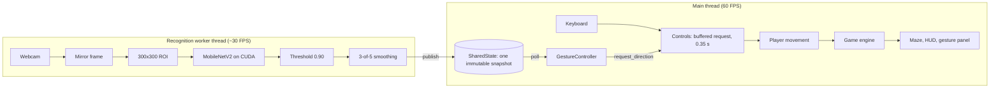

# Architecture

How CNN Gesture Controlled Pac-Man is put together, and why it is put together that way.

## The one-sentence version

A webcam frame becomes a direction request through a recognition thread that never waits for
the game, and the game consumes direction requests through one seam that does not care whether
they came from a hand or a keyboard.

## Layout

## Packages

| Package | Knows about | Must never import |
|---|---|---|
| `game/` | Pygame, the maze, the rules | `torch`, `cv2`, anything in `src/` |
| `src/game_integration.py` | The game's public seam, a recognizer protocol | Pygame drawing |
| `src/gesture_recognizer.py` | The CNN, OpenCV preprocessing | Pygame, the game |
| `src/play_gesture.py` | Both sides, to assemble the application | - |

The boundary is enforced, not just intended: `python game/main.py --selftest` parses every module
in `game/` and fails if one imports `torch`, `cv2` or `src`, and then confirms none of them was
loaded into the process. That is what keeps `python game/main.py` and
`python src/play_gesture.py --no-camera` genuinely free of the CNN.

## Threading

There are exactly two threads that matter.

**The recognition worker** owns the webcam and the model and is the only code that touches
either. It captures, mirrors, crops, runs inference, applies the threshold and the smoothing
window, and publishes the result.

**The main thread** runs Pygame: events, the game update, drawing. It never calls
`camera.read()` and never runs inference, so a camera stall cannot drop the game below 60 FPS.

They communicate through `SharedState`: one immutable `Snapshot` behind a lock. A new snapshot
replaces the old one; nothing is queued. Old camera frames have no gameplay value, so a queue
could only ever add latency. The live stability run confirmed it: over 330 seconds the number of
publishes stayed exactly equal to the number of recognised frames plus three status messages.

## From gesture to turn

1. The worker publishes `stable_command` - a direction, or `None` for "no command".
2. Each game frame, `GestureController.apply_to(game)` reads the newest snapshot.
3. If the snapshot is fresh (under 0.75 s old) and carries a direction, it calls
   `game.request_direction(direction)` - the same method the keyboard calls.
4. `Controls` holds that request for up to 0.35 s and the player takes it at the first tile
   centre where the turn is legal.

Because `request_direction` simply replaces and re-ages the pending request, calling it every
frame while a gesture is held is a *refreshed intent*, not a flood of events. Releasing the
gesture stops the refresh, and the 0.35 s grace expires the request on its own.

`None` therefore never means "stop": Pac-Man carries on in its current direction. A snapshot
older than 0.75 s is ignored entirely, so a dead worker cannot leave an old direction stuck on.

## Why the numbers are what they are

| Setting | Value | Evidence |
|---|---|---|
| Confidence threshold | 0.90 | Live trials: intentional gestures never below 0.961, idle and absent hands never above 0.617 |
| Smoothing | 3 of 5 frames | Caught the offline `down`-read-as-`up` at 0.903 that a threshold alone cannot; 0/6 spurious turns at natural speed |
| Turn buffer | 0.35 s | Covers the measured 217 ms p95 command latency plus about 130 ms of human timing error |
| Stale timeout | 0.75 s | Just over twenty camera frames: rides out hiccups, notices a dead thread quickly |
| Player speed | 6.2 tiles/s | Ghosts are capped below it, including the Chaser's end-of-round surge, so the game stays fair at gesture latency |

## Failure handling

| Failure | What happens |
|---|---|
| Model cannot load (no CUDA, wrong or tampered checkpoint) | Reported once as `CAMERA ERROR`; the keyboard keeps working |
| Webcam stops delivering frames | Reopened up to three times with a pause between attempts, showing `RECONNECTING`; then `CAMERA ERROR` |
| No audio device | Sound effects become silent no-ops, logged once |
| Corrupt profile file | Defaults are loaded; saves are atomic |
| Window closed or ESC mid-reconnect | The worker's wait is interrupted, it joins, and the camera is released |

## Memory

Both long-running parts were profiled with `src/measure_memory.py`, and the results are in
`reports/memory_profile.json`. The pass/fail check is whether memory keeps growing after start-up
(a leak), not the total size.

| Part | Footprint | After start-up |
|---|---|---|
| Game loop, keyboard, headless | 36 MB for Python and pygame, 47 MB with the game running; torch and cv2 never loaded | +0.004 MB per minute over 10 simulated minutes and 11 games, Python heap +0.04 MB |
| Recognizer, frozen model on CUDA | +118 MB to load the model, +275 MB once for CUDA/cuDNN set-up on the first frames | 1,034 MB to 1,026 MB over 5,000 frames; GPU: 17 MB allocated, 22 MB peak, 32 MB reserved of 4 GB |

Nothing in a session can grow without bound, because every buffer has a fixed size:
- The smoothing window holds five frames.
- The latency history is a fixed-size buffer.
- The shared state holds only one snapshot, and nothing is queued.

## Rendering

The static maze - filled walls with a single continuous outline - is rendered once into a cached
surface and rebuilt only when the colour theme changes. Pellets, characters and the HUD are drawn
each frame. That change took a headless frame from 2.9 ms to 0.6 ms.

Every colour comes from a `Theme`. The high-contrast and colour-blind-safe themes are palette
swaps checked by tests for WCAG contrast and for simulated colour-vision deficiency, and no state
is signalled by colour alone.

## Security

The checkpoint is verified against a pinned SHA-256 and loaded with `weights_only=True`, and its
class mapping must match the active one. See [SECURITY.md](../SECURITY.md).
